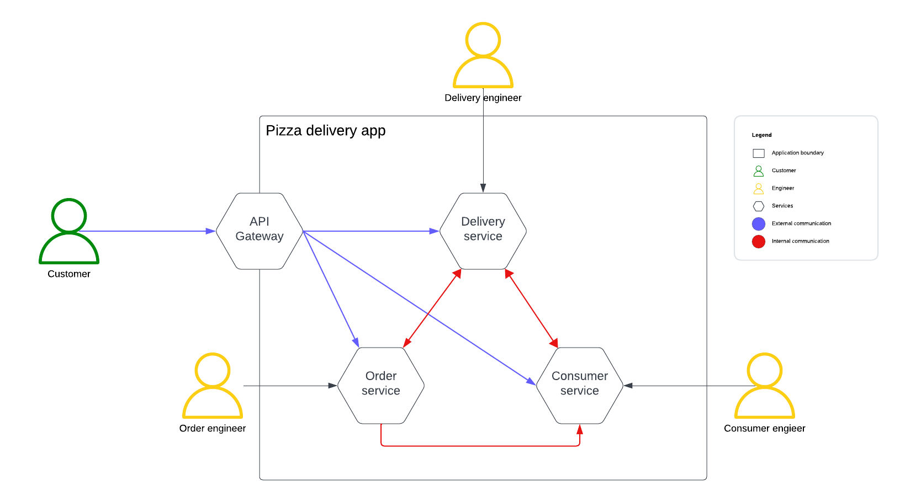

# Flow meter
The goal of this project is to measure the flow of messages on a message broker like Mosquitto.
Being able to measure the flow of messages on a broker simplifies bugging an application that runs on a micro-service architecture. 

In a microservice architecture message brokers are often used to signal between different components. The loss of messages could therefore impact the state of the application as a signal might not be properly propegated, ofcourse when creating a microservice architecture it is vital to built resilience into the architecture to account for message loss. 

As an example microservice architecture we take the Pizza delivery app as described in the image. We are interested in measuring the flow of internal communication. In total we can observe five channels where messages flow.

